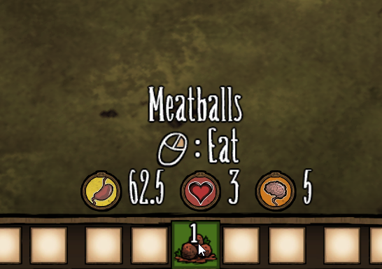

# Item Meta

Item Meta is a quality-of-life client mod for **Don't Starve Together**. It is designed to provide players with additional information about items directly in the tooltips, reducing the need to look things up on the wiki.

## Features

- Basic Metadata: Hover an item to show basic details such as nutritional values and combat stats.
- More Metadata: Hold `Ctrl` to show more metadata such as spoilage time, durability and fuel values.
- If Cooked: Hold `Alt` to show what the values will be if the item is cooked.
- User-Friendly Interface: Familiar icons are used in front of the numbers, which blends in with the UI and makes the information easy to parse.
- Fair Info: All values are static and do not provide any unfair information based on the game state.

## Installation

- Subscribe to the mod in the Steam Workshop.

Or

- Extract the content to your mods folder in the game files.

Don't forget to enable the mod in-game.

## Compatibility

This mod is for Don't Starve Together and should work seamlessly with most other mods. However, conflicts may arise with mods that also alter tooltip displays.

## Contribution and Feedback

Contributions and feedback is welcomed. Feel free to fork the repository and submit pull requests. For any issues, suggestions, or questions, please use the Issues page.

## License

The code in this project is licensed under the MIT License. While not required, if you use or find inspiration from this code, please consider making your project open-source as well.

The icons in the [`images/icons`](images/icons) folder (and [`fonts/icons.zip`](fonts/icons.zip)) are licensed under the Creative Commons Attribution-ShareAlike 4.0 License, sourced from [dontstarve.wiki.gg](https://dontstarve.wiki.gg) (e.g., https://dontstarve.wiki.gg/wiki/File:Hunger_Icon.png). Please see [`LICENSE-ICONS`](LICENSE-ICONS) for more information.
